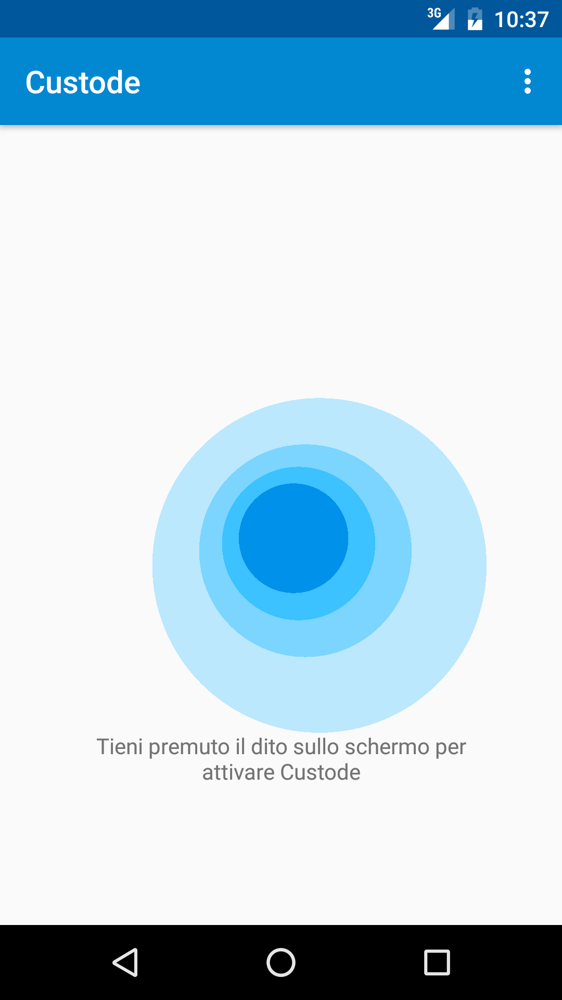
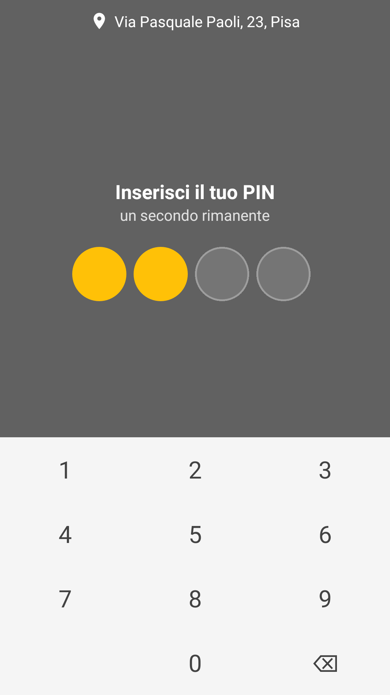
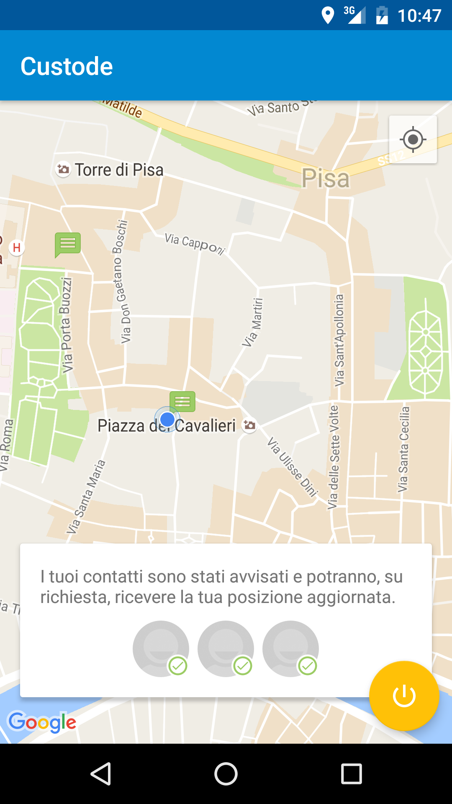
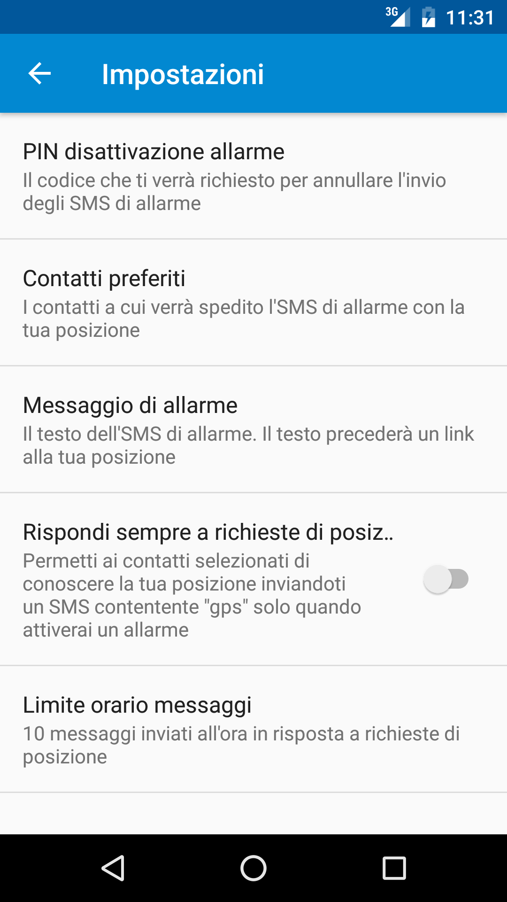

# Custode

Custode is a personal safety app for Android devices in Java. It tracks the user's location and sends messages to selected contacts when a finger is lifted off the screen and a pin is not entered within 10 seconds.

## Screenshots

    

## Contacts

Custode is developed by [Giorgio Vinciguerra](http://www.gvdev.com). All contributions to the project are greatly appreciated.

## License
This project is licensed under the terms of the GNU General Public License v3.0.
